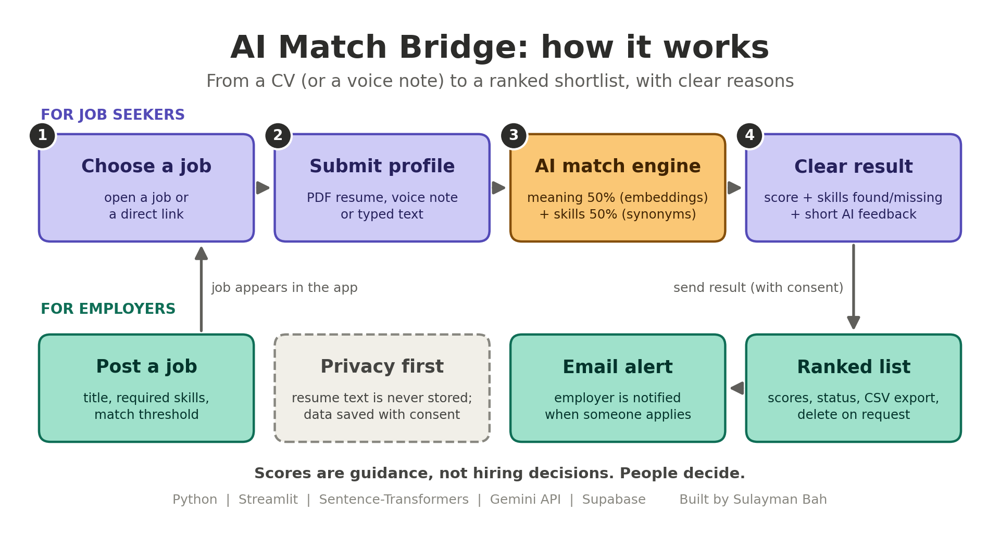

# AI Match Bridge

An AI platform that matches job seekers to employer job profiles and **explains why**, instead of giving only a number.

**Live app:** https://jobseeker-pq7vujmgd5se8rqjsvcblb.streamlit.app/



## The problem

In The Gambia, many people send CVs and never learn what was missing. Employers receive piles of CVs and have no quick way to compare them. AI Match Bridge gives candidates instant, clear feedback and gives employers a ranked shortlist.

## Features

**Job seekers**
- Pick a job, or open a direct link such as `?job=Data%20Scientist`
- Submit a PDF resume, a voice recording, or typed text
- See a match score with the skills found and the skills missing
- Get short AI feedback: strengths, gaps and next steps (Gemini API)
- See other roles that fit their profile
- Optionally send their result to the employer, with consent

**Employers**
- Passcode-protected dashboard
- Create jobs with a description, required skills, a match threshold and a notification email
- View all candidates, or a ranked list for each job
- Filter, search, update candidate status and export to CSV
- Email alert when a candidate applies
- Delete a candidate's data on request
- Shareable direct link for every job

## How the score works

```
score = 50% semantic similarity + 50% required-skill coverage
```

- **Semantic similarity:** sentence embeddings (`all-MiniLM-L6-v2`). Long resumes are split into chunks so the whole document is read, and the best-matching chunk is compared with the job description.
- **Skill coverage:** the share of the job's required skills found in the resume. Synonyms are handled (for example `ML` = `machine learning`, `sklearn` = `scikit-learn`), and short words such as `git` or `sql` need exact matches to avoid false hits.
- The semantic part is scaled between two values in `score_match` (`0.15` and `0.55`). Tune them on real resumes for your use case.

Scores are guidance for people. They are not hiring decisions.

## Tech stack

| Part | Tool |
|---|---|
| Interface | Streamlit |
| Matching | Sentence-Transformers, regex skill matching |
| Speech to text and AI feedback | Gemini API |
| PDF reading | PyPDF2 |
| Audio feedback | gTTS |
| Database | Supabase (PostgreSQL) |
| Email alerts | SMTP (Gmail app password) |

## Project structure

```
.
├── app.py              # the Streamlit app
├── requirements.txt    # Python packages
├── schema.sql          # Supabase tables (run once)
├── smtp_test.py        # tests your email settings
├── how_it_works.png    # diagram used in this README
└── samples/            # test resumes
```

## Run locally

```bash
git clone https://github.com/bahsulayman689-hash/job_seeker.git
cd job_seeker
python -m venv venv
venv\Scripts\activate          # Windows   (Mac/Linux: source venv/bin/activate)
pip install -r requirements.txt
streamlit run app.py
```

The first run downloads the embedding model (about 90 MB).

Without any secrets the app still runs in **demo mode**: data is kept in memory, and the employer page needs `EMPLOYER_PASSWORD`.

## Configuration

Secrets are read from `.streamlit/secrets.toml` (Streamlit) or from environment variables (Hugging Face, Render, Docker). Never commit them.

```toml
SUPABASE_URL = "https://your-project.supabase.co"
SUPABASE_KEY = "your-secret-key"
EMPLOYER_PASSWORD = "a-long-passcode"
GEMINI_API_KEY = "your-gemini-key"

# optional
APP_URL = "https://your-app-address"
SMTP_USER = "sender@gmail.com"
SMTP_APP_PASSWORD = "16-letter-app-password"
NOTIFY_EMAIL = "default-inbox@example.com"
```

| Secret | What it enables |
|---|---|
| `SUPABASE_URL`, `SUPABASE_KEY` | Permanent storage of jobs and candidates |
| `EMPLOYER_PASSWORD` | Access to the employer dashboard |
| `GEMINI_API_KEY` | Voice transcription and AI feedback |
| `APP_URL` | Full direct links for each job |
| `SMTP_USER`, `SMTP_APP_PASSWORD`, `NOTIFY_EMAIL` | Email alerts |

Run `python smtp_test.py` to check your email settings.

### Database setup

1. Create a project at [supabase.com](https://supabase.com).
2. Open **SQL Editor**, paste the contents of `schema.sql`, and run it.
3. Use the project's **secret** (service role) key as `SUPABASE_KEY`. Keep it server-side only. The tables use row-level security with no public policies.

## Deploy

- **Streamlit Community Cloud:** connect this repo, set `app.py` as the main file, and paste your secrets in **Settings > Secrets**.
- **Hugging Face Spaces, Render or Docker:** add the secrets as environment variables. On Render, use `streamlit run app.py --server.port $PORT --server.address 0.0.0.0`.

The embedding model needs roughly 1 to 2 GB of memory, so choose a host that allows it.

## Privacy

- Resume text is **never stored**. Only the candidate's name, contact, score and skills are saved, and only after they tick the consent box.
- Voice and AI feedback send the candidate's text to the Gemini API. The app says so before it does.
- Employers can delete a candidate's data from the dashboard.

## Limitations

- One shared employer passcode (suitable for a demo or a single employer). Multi-employer use needs real accounts.
- Scores depend on the skills list and description an employer writes. Review every candidate yourself.
- Scanned (image-only) PDFs cannot be read. Candidates can type or paste their experience instead.

## Roadmap

- [ ] Employer accounts with Supabase Auth
- [ ] Learning suggestions for missing skills
- [ ] WhatsApp contact button for employers
- [ ] Job alerts for candidates
- [ ] Automated tests for the scoring

## Author

**Sulayman Bah**, machine learning developer, The Gambia

[GitHub](https://github.com/bahsulayman689-hash) | [LinkedIn](https://linkedin.com/in/sulayman-bah-8a7096423)
